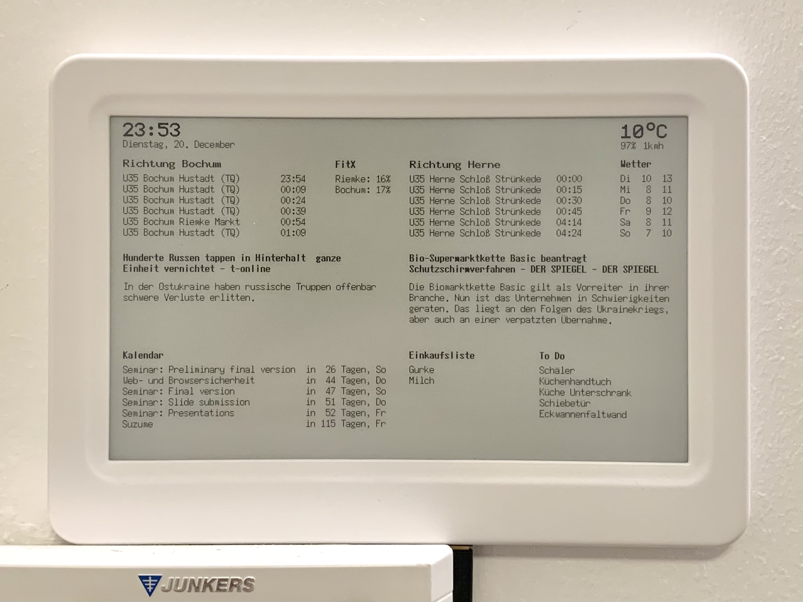
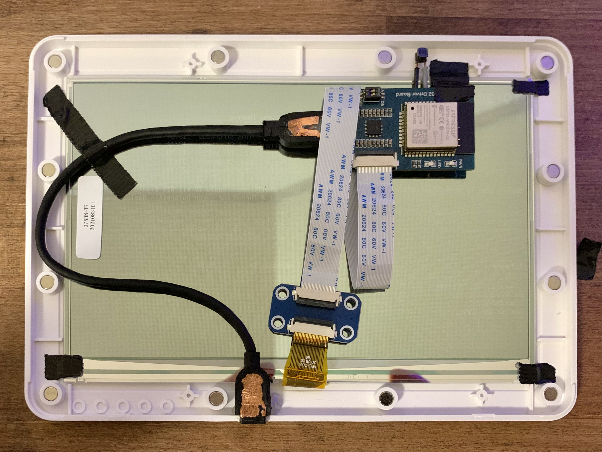
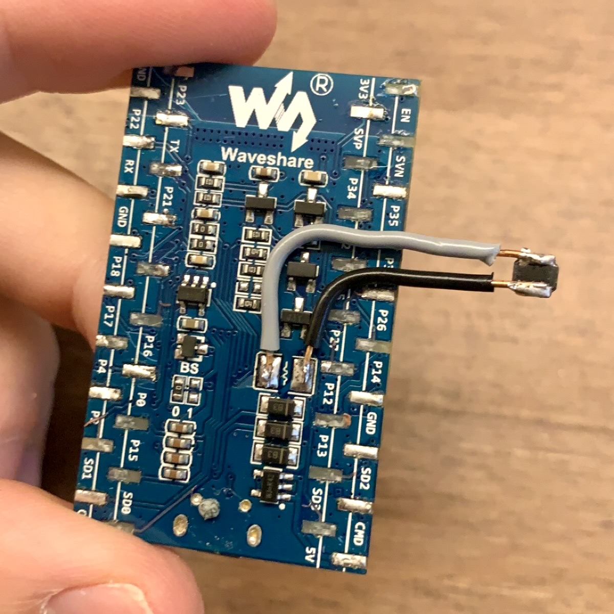

# E-Paper Project

E-Paper Display hooked up with an ESP32 to Display various information such as weather, news, train departure, appointments and to-do lists. The ESP32 is programmed with Arduino IDE in C++.

## Ré­su­mé / Thoughts on this project

I have been using this E-Paper display since the end of 2022 and it turned out genuinely useful. It helps me catch my train on time and I won't miss any important appointments.

- [E-Paper Project](#e-paper-project)
  - [Ré­su­mé / Thoughts on this project](#résumé--thoughts-on-this-project)
  - [What do you need for this project?](#what-do-you-need-for-this-project)
    - [Hardware](#hardware)
    - [Tools](#tools)
  - [Result](#result)
  - [Look inside the housing](#look-inside-the-housing)
  - [Config](#config)
  - [Troubleshoot](#troubleshoot)
    - [ESP32 is too thick for the housing](#esp32-is-too-thick-for-the-housing)
    - [The USB Extension Cable is too thick for the housing](#the-usb-extension-cable-is-too-thick-for-the-housing)
  - [How often is the data updated?](#how-often-is-the-data-updated)
  - [What is displayed?](#what-is-displayed)
    - [Time and Date](#time-and-date)
    - [Train Departure Times](#train-departure-times)
    - [Gym Utilization](#gym-utilization)
    - [Weather](#weather)
    - [News](#news)
    - [Calendar](#calendar)
    - [Shopping List](#shopping-list)
    - [To-Do List](#to-do-list)

## What do you need for this project?

### Hardware

- [ESP32 with SPI Interface](https://www.amazon.de/s?k=esp32+spi) (18,85€ @ [amazon.de](https://www.amazon.de/dp/B07RM1BBVF) Stand: 04.11.23)
- [E-Paper Display](https://www.amazon.de/s?k=e+paper+waveshare) (54,90€ @ [welectron.com](https://www.welectron.com/Waveshare-13187-75inch-e-Paper) Stand: 04.11.23)
- Housing for the E-Paper Display (5,90€ @ [welectron.com](https://www.welectron.com/Waveshare-16089-75inch-e-Paper-Case) Stand: 04.11.23)
- [USB Extension Cable](https://www.ebay.de/sch/i.html?_nkw=0%2C2m+micro+USB+Verl%C3%A4ngerungskabel) (5,99€ @ [ebay.de](https://www.ebay.de/itm/111496831577) Stand: 04.11.23)

### Tools

- Soldering Iron
- Glue Gun

## Result

*Here you can see the result mounted to the wall*

## Look inside the housing

In this picture, you can see the ESP32 and the E-Paper Display inside the Housing. The ESP32 is connected to the E-Paper Display via SPI. The ESP32 is powered by a USB cable which is connected to a USB power supply. The USB cable is routed through the housing and glued to the bottom of the housing so the USB cable is easily replaceable.

## Config

A part on how to configure this project is comming soon.

## Troubleshoot

During this project, I encountered some difficulties.

### ESP32 is too thick for the housing

|To solve this issue, I removed the chip and soldered a cable to the pins so that the chip is located next to the ESP. Now the ESP32 fits in the housing, great.||
|---|---|

### The USB Extension Cable is too thick for the housing

I removed some plastic from the cable so it can fit in the housing.

## How often is the data updated?

- **Every minute**
  - Time and Date
  - Train Departure Times
- **Every 15 minutes**
  - Weather
  - News
  - Gym Utilization
  - Calendar
  - Shopping List
  - To-Do List

To prevent the colors from washing out, there is a full refresh every hour.
Otherwise, partial refreshes are always used.

## What is displayed?

### Time and Date

The Time and Date are displayed in the upper left corner.

### Train Departure Times

U35 departure times are listed for both directions and also with delays in minutes.

API: [vrr.de](https://vrr.de)

### Gym Utilization

Also, there is gym utilization which indicates how many people are currently in your gym.

API: [FitX](https://fitx.de)

### Weather

Current weather data is displayed in the upper right-hand corner. This displays the current temperature, wind speed and humidity. In addition, the highest and lowest temperatures are displayed for the next 7 days.

API: [weather.com](https://weather.com)

### News

News are obtained through the NewsAPI. There is a limit of 100 requests per day. You cannot do more than one request every 15 minutes with a free account.

API: [NewsAPI](https://newsapi.org)

### Calendar

Calendar events are displayed in the lower left corner. The events are listed with a countdown and the day of the week.
The events are pulled from a Google calendar. If I want it to be displayed on the E-Paper, I just have to add an event with my calendar app.

API: [Google](https://developers.google.com/calendar/api/v3/reference)

### Shopping List

The shopping list is pulled from Microsoft's To-Do app. Just add something to the shopping list and it gets pulled from Microsoft Graph API.

API: [Microsoft Graph API](https://docs.microsoft.com/en-us/graph/api/resources/todo-overview)

### To-Do List

Same as [Shopping List](#shopping-list).

API: [Microsoft Graph API](https://docs.microsoft.com/en-us/graph/api/resources/todo-overview)
